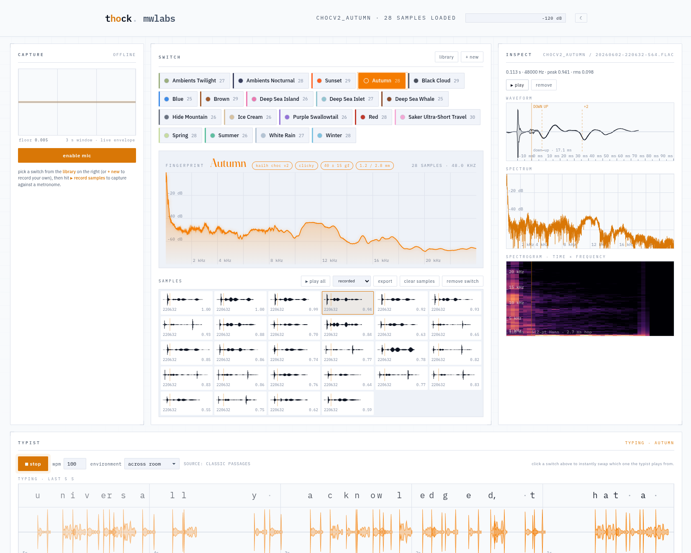
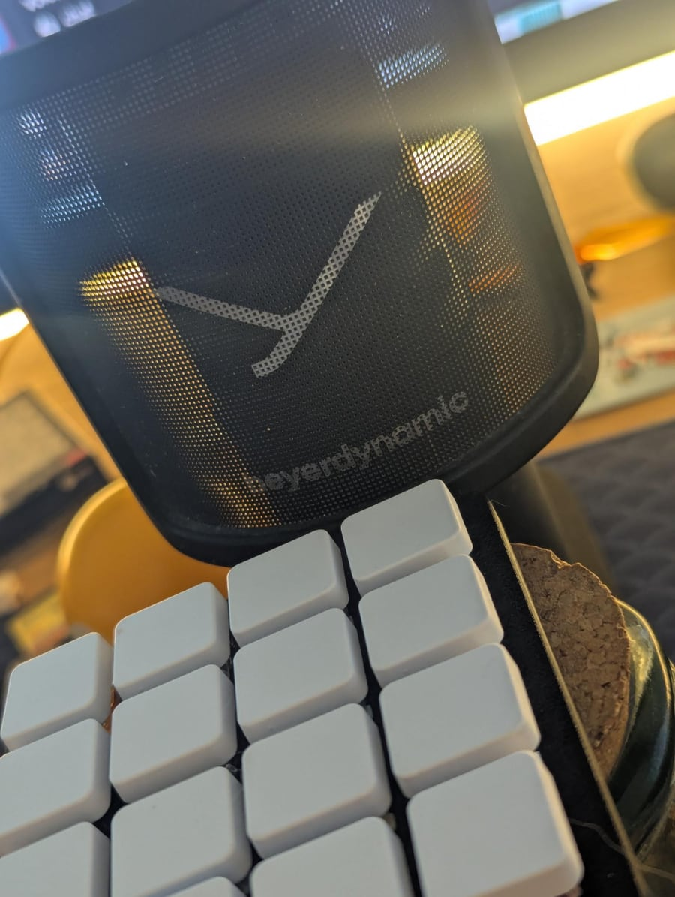

#+TITLE: thock
#+AUTHOR: mwlabs
#+OPTIONS: toc:2 num:nil

A browser tool to A/B mechanical switches by sound. Record a switch
into your mic, build a per-switch spectrum fingerprint, play the
library back as if you were typing prose. Hot-swap switches
mid-sentence. Static site, files stay local.

Live: *https://thock.mwlabs.be*

* UI

- *library*: 19 pre-recorded switches (16 Kailh Choc v2, 3 v1).
  Each tile shows type, force, travel; the colour dot matches the
  stem.
- *record*: name a switch, hit /▶ record samples/. A metronome
  paces ~60 taps; thock keeps the cleanest ~30.
- *fingerprint*: averaged smoothed spectrum across all samples.
  Picking another switch overlays its curve on the same axes.
- *inspect*: single-sample view with waveform, FFT, spectrogram,
  and down→up timing.
- *typist*: plays the selected switch as prose at a chosen WPM.
  Click another switch and it hot-swaps mid-sentence.
- *environment*: filter chain that mimics listening contexts.
  =raw=, =gasket build=, =foam-lined=, =hollow plastic=, =tin can=,
  =across desk=, =across room=, =next room=, =underwater=.
- *export*: zips your recordings with a =meta.json=, ready to
  contribute.

* Running locally

Static site, no build:

#+BEGIN_SRC sh
python -m http.server 8765
#+END_SRC

Or via [[https://devenv.sh][devenv]]: =devenv up=.

* Contributing recordings

The library is CC BY 4.0. Switches off the Choc shelf welcome,
especially MX, Kailh Butterfly, and low-profile oddballs.

Bar: decent mic, quiet room, switch tester so the build doesn't
colour the recording. Bad ones get rejected; mine aren't pristine
either.

** Reference setup

Beyerdynamic FOX over a 3D-printed switch tester plate on a cork
coaster. You don't have to match it; a thin plate on cork or foam
lands in the same ballpark.

** Workflow

1. =+ new=, name in =lowercase_with_underscores=, fill in type /
   force / pretravel / total travel from the datasheet.
2. =▶ record samples=, run the metronome pass.
3. =export= gives you a zip.

Email it to /info@mwlabs.be/, or open a PR: run
=python scripts/bundle_library.py <unzipped_dir>= and commit the
resulting =library/<id>/= and =index.json=.

** meta.json

Auto-generated by =export=. Hand-edit if you need to:

#+BEGIN_SRC json
{
  "name":        "MX Red",
  "family":      "Cherry MX",
  "description": "Linear · 45 gf · 2.0 mm pretravel",
  "color":       "#e25555"
}
#+END_SRC

Colour matches the physical stem.

* Repo

- =index.html=, =app.js=, =styles.css=, =capture-worklet.js=: the app
- =scripts/bundle_library.py=: WAVs into a FLAC catalog
- =library/=: the curated FLAC payload

* License

Code MIT (=LICENSE=). Library recordings CC BY 4.0
(=library/LICENSE=); attribute MWLabs if you reuse.
