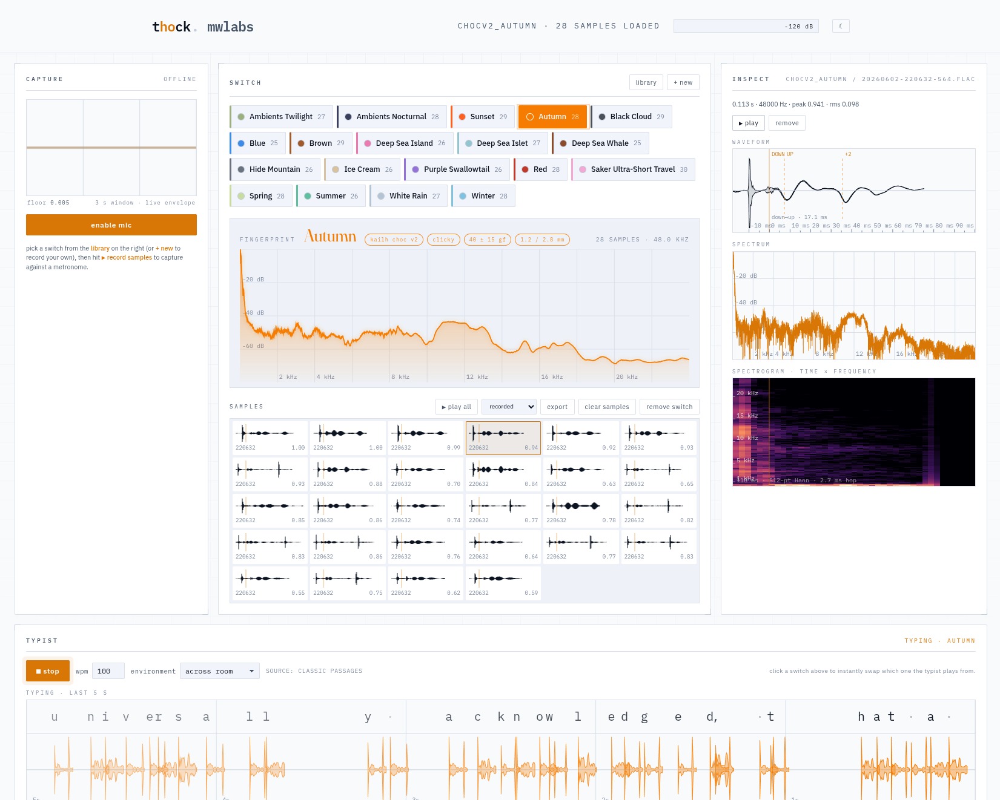
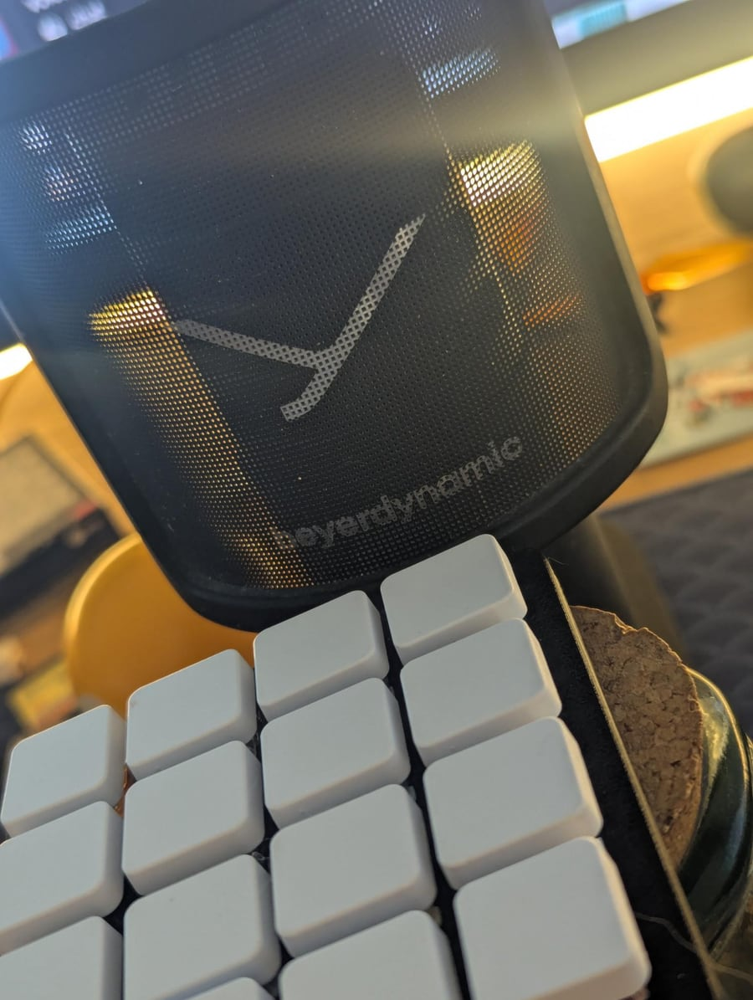

#+TITLE: thock
#+AUTHOR: mwlabs
#+OPTIONS: toc:2 num:nil

A browser tool to A/B mechanical switches by sound. Record a switch
into your mic, build a per-switch spectrum fingerprint, play the
library back as if you were typing prose. Hot-swap switches
mid-sentence. Static site, files stay local.

Live: *https://thock.mwlabs.be*

* UI

- *pick*: choose one or more of the 19 pre-recorded switches
  (16 Kailh Choc v2, 3 v1). Only the picked switches get downloaded.
- *play*: type on your keyboard, or tap the keys, and a virtual
  [[https://github.com/mwlaboratories/atlas][Atlas]] (the built
  34-key prototype: board from its KiCad PCB, case from its STLs)
  presses along and plays the selected
  switch. Swap switches mid-sentence from the row on top. Digits,
  symbols and arrows light the key you'd press on Atlas's layers.
- *environment*: the select in the top bar runs the playback through
  a filter chain that mimics listening contexts: =raw=, =gasket
  build=, =foam-lined=, =hollow plastic=, =tin can=, =across desk=,
  =across room=, =next room=, =underwater=.
- *lab* (=/lab=): the original recorder and analysis toolbox:
  mic capture against a metronome, spectrum fingerprints, per-sample
  inspection, the auto-typist, and export for contributions.

* Running locally

Static site, no build:

#+BEGIN_SRC sh
python server.py
#+END_SRC

Or via [[https://devenv.sh][devenv]]: =devenv up= (=server.py= also
maps =/lab= to =lab.html= like Vercel's clean URLs).

* Contributing recordings

The library is CC BY 4.0. Switches off the Choc shelf welcome,
especially MX, Kailh Butterfly, and low-profile oddballs.

Bar: decent mic, quiet room, switch tester so the build doesn't
colour the recording. Bad ones get rejected; mine aren't pristine
either.

** Reference setup

Beyerdynamic FOX over a 3D-printed switch tester plate on a cork
coaster. You don't have to match it; a thin plate on cork or foam
lands in the same ballpark.

** Workflow

1. Open the lab (=/lab=), =+ new=, name in =lowercase_with_underscores=, fill in type /
   force / pretravel / total travel from the datasheet.
2. =▶ record samples=, run the metronome pass.
3. =export= gives you a zip.

Email it to /info@mwlabs.be/, or open a PR: run
=python scripts/bundle_library.py <unzipped_dir>= and commit the
resulting =library/<id>/= and =index.json=.

** meta.json

Auto-generated by =export=. Hand-edit if you need to:

#+BEGIN_SRC json
{
  "name":        "MX Red",
  "family":      "Cherry MX",
  "description": "Linear · 45 gf · 2.0 mm pretravel",
  "color":       "#e25555"
}
#+END_SRC

Colour matches the physical stem.

* Repo

- =index.html=, =thock.js=, =thock.css=: the audition screen
- =atlas-geometry.js=: Atlas key positions and case outline,
  generated by =scripts/atlas_geometry.py= from an atlas checkout
- =engine.js=: low-latency playback (Web Audio, room EQ, sample picking)
- =lab.html=, =app.js=, =styles.css=, =capture-worklet.js=: the lab
- =scripts/bundle_library.py=: WAVs into a FLAC catalog
- =library/=: the curated FLAC payload

* License

Code MIT (=LICENSE=). Library recordings CC BY 4.0
(=library/LICENSE=); attribute MWLabs if you reuse.
